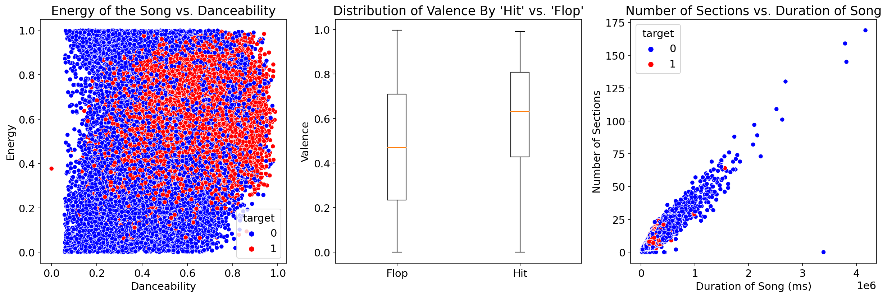
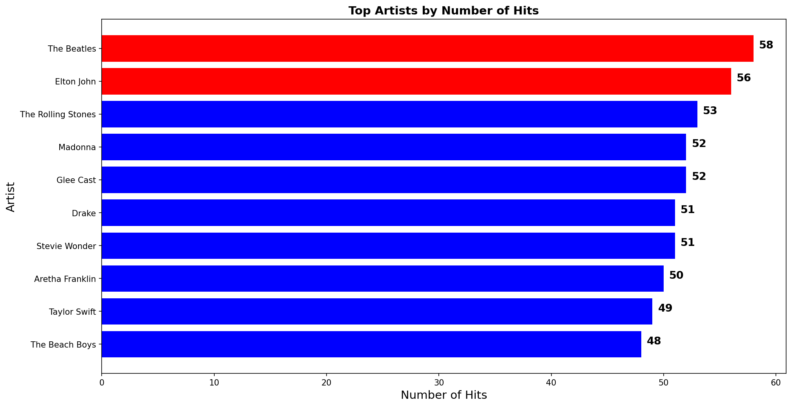
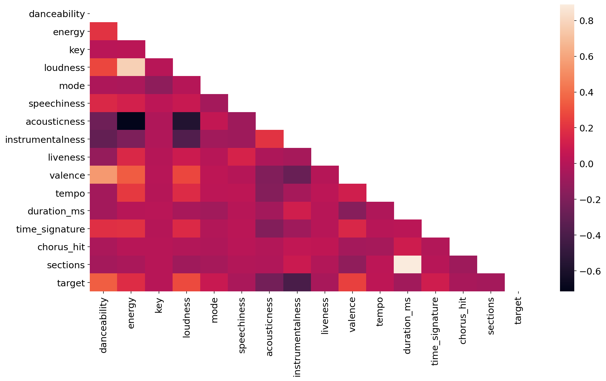
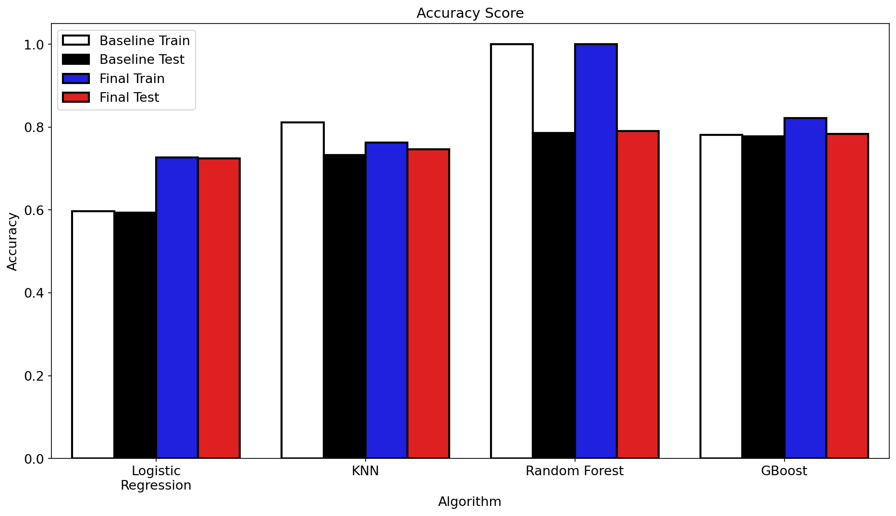
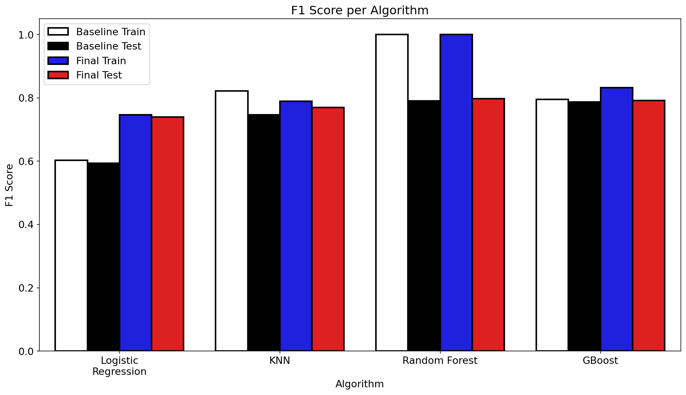
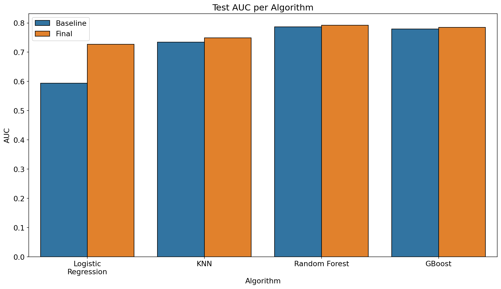
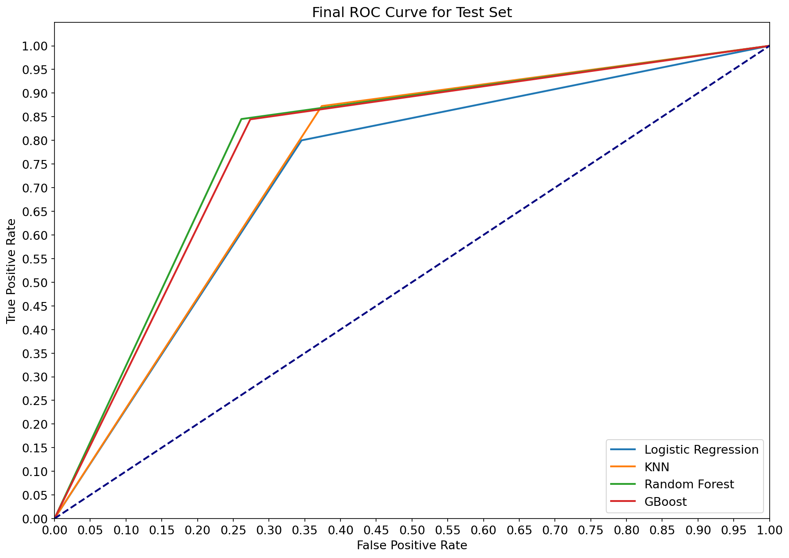

# Predicting a Song's Success using Machine Learning

## Author: [Patricio Contreras](https://www.linkedin.com/in/pcontreras97/)

## Overview

The main goal of this project is to develop a machine learning model that predicts whether a song will be considered a "hit" or "flop".  Before creating the model, exploratory data analysis will be performed in order to learn about our data and visualise interesting relationships between the variables.  Once this is carried out and the data is cleaned, a series of different machine learning algorithms will be trained and evaluated in their predictive performance.  After comparing and reviewing the results obtained, the algorithm with the best performance overall will be chosen.

## Business Problem

Composing a song is by no means an easy feat.  Nowadays music of all different genres is available to a larger audience and tastes in music are more diversified than ever.  This means that artists must take into account several factors that could potentially determine if the song is well-received by the public or not.  Should my song be more energetic?  Should my song be long or short?  Should I focus on the song being loud?  Or do people prefer acoustic songs?

In an effort to assist music artists and minimise the risk of composing a "flop", the goal of this project is to provide predictions on a potential song's success by taking into account factors like danceability, acousticness, loudness, etc.

## The Data

This project uses the *Spotify Hit Predictor Dataset* found in the [data](data) folder.  It contains data on songs from 1960 all the way to 2019.  For more information on how the data was obtained, please visit this Kaggle [website](https://www.kaggle.com/theoverman/the-spotify-hit-predictor-dataset?select=LICENSE).

## Methods

This project follows the Cross-Industry Standard Process for Data Mining (CRISP-DM).  We begin by investigating the data using techniques such as exploratory data analysis with visualisations.  Once we gain a solid understanding of the data we're working with, data cleaning is performed to prepare our data for model creation.  This is where [EDA](EDA.ipynb) ends.

Having cleaned the data as much as possible, we start off [ML](ML.ipynb) by creating 4 candidate baseline machine learning classifiers with all our features/variables.  Once we evaluate their predictive performance, we try and optimise each classifier through methods such as hyperparameter tuning, grid search, recursive feature elimination, etc.  In the end, the model with the best predictive performance is chosen.

## CRISP-DM

## Data Understanding

* Hit songs tend to have a high `danceability` and `energy` score
* Do happier songs succeed more than sad songs?  The boxplot indicates that hit songs have a slightly higher `valence` value than flops
* While there is a strong relationship between the duration of a track and the number of sections it has, these two don't influence a track's success too much

Unsurprisingly, *The Beatles* are the most successful band/artist in terms of hit songs in this dataset.

## Data Preparation

While most features had low correlations with one another, `duration_ms` and `sections` stood out with a high correlation.  This could mean a multicollinearity later on.  After further investigation, we removed `sections` from the dataset.

## Modelling 

The four candidate machine learning algorithms used in this project are: Logistic Regression, K-nearest Neighbours, Random Forest, and Gradient Boosting.  Even though `statsmodels` was used briefly while trying to tune our Logistic Regression model, everything else was taken care of using `sklearn`.

The evaluation metrics used for this project were train/test: accuracy, F1 score, AUC, and ROC curves.  The following illustrate the baseline and final results obtained from all algorithms:

The plots above show us the difference in performance between the baseline model and the final.  Here are the most important points:

* Logistic Regression's performance improved quite a lot in all areas
* KNN's training accuracy and F1 score dropped but was compensated by increasing test scores.  The difference between training and test scores decreased
* Random Forest is the algorithm that didn't have much of a change in all areas.  Unfortunately, the model still overfits the training data
* Gradient Boost's training scores improved over 80% while test scores increased minimally.  Test AUC did increase too.

## Choosing the Final Model

After reviewing all of the performance graphs shown above, Random Forest would seem like the best performing algorithm for this dataset and problem.  It excels in training scores (both accuracy and F1) and has the steepest ROC curve out of all the classifiers.  Furthermore, the fact that it's an ensemble method makes it robust to variance and feature selection.

**However**, the chosen model for this project will have to be **Gradient Boosting**.  This is precisely because of the Random Forest's stellar training performance.  The huge difference in training and test scores (for both accuracy and F1) suggest that Random Forest overfitted the training data and won't perform as well on unseen data.  In contrast, Gradient Boost has a smaller difference between training and test scores and has an AUC very close to Random Forest.  Even though Gradient Boosting did not do excepcionally well on the training data, the results obtained suggest that it's a more "balanced" algorithm than Random Forest.

## For More Information

To see the full analysis, check out [EDA](EDA.ipynb).  For a more concise presentation, take a look at [presentation.pdf](presentation.pdf).